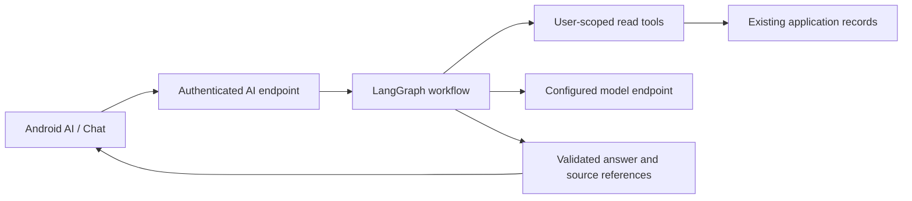

# AI tab and LangGraph integration proposal

Date: 6 October 2026; implementation update 7 October. The native Android composer now has its model selector inside the prompt field, retained drafts, cancellation and bounded request/response JSON through an authenticated endpoint. The LangGraph backend, provider execution, streaming and grounded source links remain proposed work; see [the catch-up verification record](../catchup-2026-10-06.md).

## Confirmed product decisions

The five root tabs become **Home, Services, Reminders, AI, Profile**. AI replaces the current Insights root and contains **Chat** (default) and **Insights**. Switching these subviews preserves their separate scroll/filter/conversation state. Existing recommendations remain accessible through Insights; they do not become conversational messages or lose their stored evidence.

Start with one configured model: **Nemotron 3.5 Lightning (free)**. The compact model selector lives inside the composer and offers this single supported option. Future model choices should appear only after their endpoints and data handling have been integrated and verified. Keep headers free of back arrows; Android Back and gestures handle navigation.

The initial Chat design uses fictional subscription data. Suggested prompts: “What renews next?”, “Explain my monthly spend”, and “Which services should I review?” Show concise answers, the currency and calculation period, and tappable source records. A sample answer must be labelled as a demo; it is not evidence that the model or data integration already runs.

## Endpoint verified through Exa

OpenRouter lists `nvidia/nemotron-3.5-lightning:free` with zero prompt/completion token pricing and support for `tools` and `tool_choice`. Its free endpoint does **not** support `response_format`; validate any generated structured values on the backend before using or persisting them. The paid identifier omits `:free` and must not be substituted silently. [Model catalog](https://openrouter.ai/nvidia/nemotron-3.5-lightning:free)

The hosting guidance states that NVIDIA logs use for security and product improvement and asks users not to submit confidential information or personal data through this free endpoint. Therefore the free-model prototype must use synthetic, non-sensitive data. Connecting real account financial records requires a suitable endpoint and a deliberate review of its data terms first; removing names alone does not establish that financial records are non-sensitive. [OpenRouter endpoint guidance](https://openrouter.ai/blog/insights/nemotron-3-5-lightning/)

The published free-variant limits are 20 requests/minute and 50 requests/day when lifetime purchased credits are below 10; the published higher tier is 1,000/day after at least 10 purchased credits. Treat these as account/provider limits, not a per-user allowance, and check actual account capacity before deployment. Free availability can change. Handle HTTP 429 with bounded retry, honour `Retry-After`, and show a recoverable limit message. Never enable paid fallback without an explicit product decision. [Official rate-limit contract](https://openrouter.ai/docs/api_reference/limits), [free variant](https://openrouter.ai/docs/guides/routing/model-variants/free)

## Smallest backend boundary

LangGraph coordinates the steps of an AI workflow; Nemotron generates language within that workflow. Neither owns the Android navigation. Keep LangGraph in the trusted backend already planned for optional AI. A small Python endpoint using OSS LangGraph is a practical proposal; the final hosting/runtime choice should be made with the actual backend implementation. Do not create an additional general CRUD service or move current Android CRUD behind LangGraph just to introduce Chat.

The endpoint validates the signed-in access token, resolves the application profile, and scopes every record lookup to that profile. The Auth UUID and application bigint user ID are distinct. Model-supplied IDs, conversation IDs, source IDs and confirmation requests are untrusted inputs. A conversation identifier selects history; it does not grant access. Enforce ownership server-side even when a privileged database client bypasses row policies. Provider credentials stay on the server. These boundaries preserve the existing [database contract](../database.md) and [ADR 0001](../adr/0001-supabase-auth-and-mvp-data.md).

Provide small read tools for subscription summaries, upcoming reminders and budget comparisons. Tools use ordinary deterministic domain calculations, including decimal money and separate currency totals. The model explains their results; it must not invent conversions, historical trends, usage measurements or savings certainty. Return source references from the actual tool results and validate them before displaying record links.

MVP scope is **read-only Q&A**. When an answer suggests changing a record, link to its existing edit/review screen. This is quicker and preserves the current mutation contracts. Conversation-driven writes are a later feature, requiring the confirmation flow below.

## Proposed conversation contract

Keep implementation-specific LangGraph events behind an application-owned response contract. Each message/run has a stable identifier; every response belongs to an authorized conversation. Expose answer deltas, a short user-facing status, validated source references, completion and recoverable failure. Deduplicate replayed events after reconnection. Do not expose raw internal reasoning or tool traces as chat text. LangGraph supports streaming graph updates and model output, but the Android client should not depend on every internal event shape. [Streaming documentation](https://docs.langchain.com/oss/python/langgraph/streaming)

Show sending, streaming, completed, cancelled and failed states. While a run is active, offer Stop and avoid duplicate submits. Preserve an unsent composer draft when switching tabs or rotating. A failed/limited run retains the question and offers a deliberate retry. If a partial answer is retained after failure, label it incomplete. Keyboard insets and large text must leave the composer and last answer reachable.

Server-side durable conversation storage is a new requirement, not an existing table capability. LangGraph checkpointing stores workflow state by thread; production persistence needs a durable checkpointer. Define retention/deletion, ownership and migration before enabling stored conversations. Keep prototype memory explicitly temporary if it is not persistent. Do not store access tokens or provider keys in graph state. [Memory and persistence](https://docs.langchain.com/oss/python/langgraph/add-memory)

Own-server authentication must be implemented at its API boundary. LangSmith deployment examples using custom `Auth` handlers are deployment-specific; they do not automatically secure an arbitrary OSS LangGraph server. [LangSmith custom authentication](https://docs.langchain.com/langsmith/custom-auth)

## Optional confirmed writes after the read-only MVP

1. Generate a validated proposal identifying the exact record, expected version and before/after values. Re-read the record before presenting the change.
2. Pause and present a confirmation sheet. The user can confirm or dismiss; an unrelated later message is not consent.
3. On confirmation, re-check identity, ownership, current values and proposal expiry. Apply an idempotent domain mutation; duplicate confirmations must not duplicate reminders or decisions.
4. Return the stored result, or explain a conflict/failure. Keep the original draft when a write fails.

LangGraph `interrupt()` can pause for confirmation and resume with `Command`; it requires checkpointing and a thread identifier. Nodes may restart on resume, so side effects must not run before consent or be repeated unsafely. An interrupt is workflow control, not authorization. [Interrupt and resume contract](https://docs.langchain.com/oss/python/langgraph/interrupts)

Approving an insight records an approved/rejected/ignored decision under the existing schema. It does not cancel a provider subscription, move money or perform a bank operation. Preserve that wording in both Chat and Insights.

## Verification required when implemented

Test cross-user conversation and source access, expired sessions, two-currency summaries, bounded model/tool output, duplicate submits/events, disconnect and cancellation, provider timeout and 429, and failure after partial streaming. For any later write flow, test replayed confirmations, stale proposals and authorization on resume. The native client tests cover draft retention, absent-endpoint handling and authentication/navigation boundaries; see the catch-up verification record. Backend streaming, conversation ownership and provider execution remain unimplemented and unverified. Keyboard layout, large text and TalkBack still require device acceptance checks.
